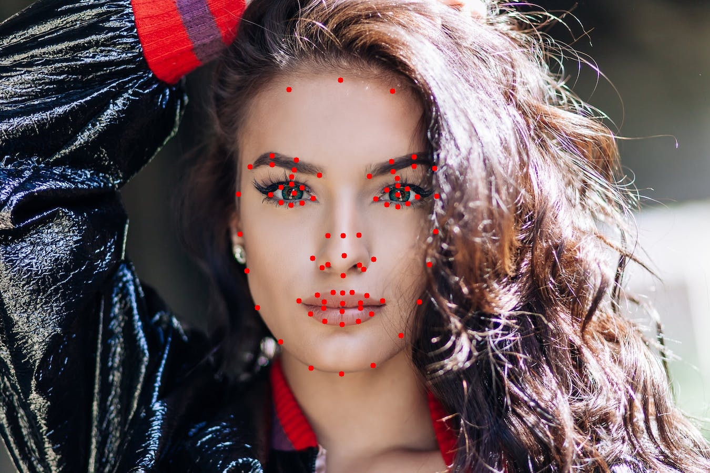

# FaceMask
Extract Face mask out of image of a person

This project uses stasm library in Python to detect 78 landmarks on Human Face. Using those landmarks or key-points a Face Mask is generated. The main function used in the code is stasm.search_single(<image_name>), which returns a list of landmarks.

BORDER_POINTS = list(range(0, 16))

RIGHT_BROW_POINTS = list(range(17, 22))

LEFT_BROW_POINTS = list(range(23, 28))

RIGHT_EYE_POINTS = list(range(29, 38))

LEFT_EYE_POINTS = list(range(39, 48))

NOSE_POINTS = list(range(49, 59))

MOUTH_POINTS = list(range(59, 77))

# Input Image

# Face Landmarks

# Face Mask

